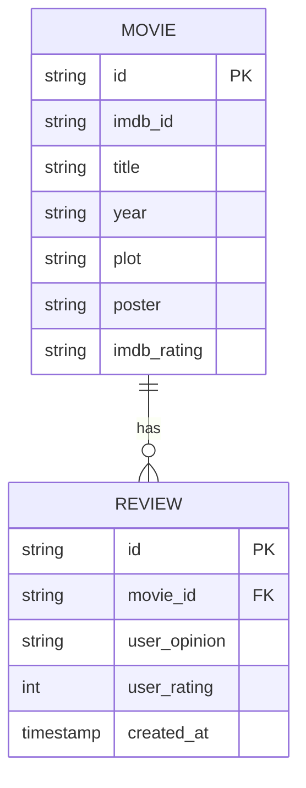

# Movie Review API


API para avaliação de filmes integrada com OMDb API, seguindo os princípios de Arquitetura Hexagonal, Clean Architecture e Domain-Driven Design (DDD).

## Diagrama do Banco de Dados



## Requisitos

- Node.js v18+
- PostgreSQL
- Chave da API OMDb (obtenha em http://www.omdbapi.com/)
- Docker (recomendado para execução em container)

## Instalação com Docker Compose

```bash
# Clonar o repositório
git clone https://github.com/LucaGuidoRegolini/beecrowd_test.git
cd beecrowd_test

# Configurar variáveis de ambiente
cp .env.example .env
# Editar o .env com suas configurações (OMDB_API_KEY obrigatória)

# Iniciar os containers
docker-compose up -d
```

O docker-compose.yml inclui:
- **API**: Aplicação NestJS na porta 3000
- **PostgreSQL**: Banco de dados na porta 5432
- **Nginx**: Servidor web/reverse proxy na porta 80

## Configuração do Nginx como API Gateway

O Nginx está configurado como reverse proxy com as seguintes rotas:

```
server {
    listen 80;

    location /api/movies {
        proxy_pass http://api:3000/movies;
    }

    location /api/reviews {
        proxy_pass http://api:3000/reviews;
    }
}
```

## Endpoints

### POST /api/movies/create
Cria uma avaliação para um filme. Se o filme não existir localmente, busca os dados da OMDb API.

**Request:**
```json
{
  "imdb_id": "tt1375666",
  "user_opinion": "Excelente filme com efeitos visuais impressionantes.",
  "user_rating": 9
}
```

### GET /api/movies/search
Busca filmes por título e/ou ano.

**Parâmetros:**
- title (opcional)
- year (opcional)

### GET /api/reviews
Lista todas as avaliações cadastradas.

## Execução Local (sem Docker)

```bash
# Instalar dependências
npm install

# Rodar migrações do Prisma
npx prisma migrate dev

# Desenvolvimento
npm run start:dev

# Produção
npm run build
npm run start:prod
```

## Testes

```bash
# Rodar todos os testes
npm test

# Rodar testes com cobertura
npm run test:cov

# Rodar testes específicos (ex: serviço de filmes)
npm test src/core/application/services/movie.service.spec.ts

# Rodar testes e2e
npm run test:e2e
```

## Tecnologias Utilizadas

- NestJS
- PostgreSQL
- Prisma ORM
- OMDb API
- Docker
- Nginx

## Estrutura do Projeto

```
src/
├── core/           # Lógica de negócio (Clean Architecture)
├── modules/        # Módulos da aplicação
├── shared/         # Recursos compartilhados
test/               # Testes unitários e e2e
prisma/             # Configuração do Prisma
docker/             # Configuração Docker
```